# 🔄 Enhanced Evaluation RAG Workflow v2 z GPT Augmentation

## 🎯 **Nowy Flow Diagram**

```mermaid
graph TD
    A[Initialize Evaluation] --> B[Analyze Query Intent]
    B --> C{Business/Trade Secret?}
    C -->|Business| D[Handle Business Query]
    C -->|Trade Secret| E[Check Trade Secrets] 
    C -->|Regular| F[Execute Search Attempt]
    D --> Z[END]
    E --> Z
    
    F --> G[Enhanced Evaluate Content Quality]
    G --> H{Store Best Partial?}
    H -->|Yes 5.0+| I[Store Partial Result]
    H -->|No| J{Quality Check}
    I --> J
    
    J -->|✅ >= 7.0| K[Generate Answer]
    J -->|❌ < 4.0| L{Attempts < 3?}
    J -->|⚠️ 4.0-6.9| L
    
    L -->|Yes| F
    L -->|No, No Partial| M[Standard Escalation]
    L -->|No, Has Partial| N[🆕 GPT Augmentation Mode]
    
    N --> O[Generate Augmented Response]
    O --> P[Second Evaluation]
    P --> Q{Augmented Quality?}
    Q -->|✅ >= 7.0 + Safe| K
    Q -->|❌ Failed| M
    
    K --> Z
    M --> Z
```



## 🔧 **Enhanced State Definition**

```python
class EnhancedEvaluationRAGStateV2(TypedDict):
    # ... existing fields ...
    
    # 🆕 NEW: Partial Results Tracking
    best_partial_result: Dict  # Best 5.0+ result from any attempt
    best_partial_confidence: float  # Confidence of best partial
    attempt_confidences: List[float]  # Track all attempt confidences
    has_usable_partial: bool  # Flag for augmentation eligibility
    augmentation_used: bool  # Track if augmentation was applied
    augmentation_confidence: float  # Final augmented confidence
```

## 🚀 **Modified Workflow Nodes**

### **1. Enhanced Evaluate Content Quality v2**

```python
def enhanced_evaluate_content_quality_v2(state: EnhancedEvaluationRAGStateV2):
    """Enhanced evaluation with partial result tracking"""
    attempt = state["attempt_count"]
    results = state["search_results"]
    
    # Model evaluates content quality
    confidence, reasoning = components.evaluate_content_quality(
        state["original_query"], results
    )
    
    print(f"📊 Attempt {attempt} confidence: {confidence}/10")
    
    # 🆕 TRACK BEST PARTIAL RESULT (5.0+)
    if confidence >= 5.0 and confidence > state.get("best_partial_confidence", 0):
        print(f"💾 Storing partial result: {confidence}/10")
        best_partial = {
            "confidence": confidence,
            "reasoning": reasoning,
            "results": results,
            "attempt": attempt,
            "query": state["current_query"]
        }
        state.update({
            "best_partial_result": best_partial,
            "best_partial_confidence": confidence,
            "has_usable_partial": True
        })
    
    # Track attempt confidence
    attempt_confidences = state.get("attempt_confidences", [])
    attempt_confidences.append(confidence)
    
    # Get threshold for this query type
    threshold = state.get("confidence_threshold_override", 7.0)
    
    # DOSAGE FALLBACK (unchanged)
    if (state["query_intent"] == "dosage" and 
        confidence < threshold and 
        attempt >= MAX_REASONING_ATTEMPTS):
        return dosage_fallback_response(state)
    
    # STANDARD EVALUATION
    if confidence >= threshold:
        print(f"✅ Quality sufficient ({confidence}/10)")
        return quality_sufficient_response(state, confidence)
    elif confidence < 4.0 and attempt >= MAX_REASONING_ATTEMPTS:
        return check_augmentation_eligibility(state)
    elif attempt >= MAX_REASONING_ATTEMPTS:
        return check_augmentation_eligibility(state)  # 🆕 Check for partial
    else:
        print(f"🤔 Continue reasoning (attempt {attempt}/3)")
        return continue_reasoning_response(state, confidence)

def check_augmentation_eligibility(state):
    """🆕 Decide: Augmentation vs Standard Escalation"""
    if (state.get("has_usable_partial", False) and 
        state["query_intent"] not in ["business", "dosage", "production"]):
        
        print(f"🧠 GPT AUGMENTATION MODE: Using partial {state['best_partial_confidence']}/10")
        return {
            **state,
            "should_continue": False,
            "escalate": False,
            "use_augmentation": True,  # 🆕 Trigger augmentation
            "evaluation_log": [f"Max attempts reached - triggering GPT augmentation with partial {state['best_partial_confidence']}/10"]
        }
    else:
        print(f"⚠️ Standard escalation (no usable partial)")
        return standard_escalation_response(state)
```

### **2. New Node: GPT Augmentation**

```python
def gpt_augmentation_mode(state: EnhancedEvaluationRAGStateV2):
    """🆕 NEW: GPT Knowledge Augmentation"""
    print(f"🧠 AUGMENTING with GPT knowledge...")
    
    partial = state["best_partial_result"]
    
    # Build augmentation context
    partial_content = ""
    for result in partial["results"][:3]:
        partial_content += f"ŹRÓDŁO: {result['title']}\n{result['full_content'][:300]}...\n\n"
    
    augmentation_prompt = f"""
    {ENHANCED_AQUAFOREST_EXPERT_PROMPT}
    
    === TRYB AUGMENTACJI WIEDZY ===
    
    Masz częściową wiedzę z bazy Aquaforest (confidence: {partial['confidence']}/10), 
    ale jest niewystarczająca do pełnej odpowiedzi.
    
    CZĘŚCIOWA WIEDZA Z BAZY:
    {partial_content}
    
    PYTANIE UŻYTKOWNIKA: "{state['original_query']}"
    
    ZADANIE - CONTROLLED AUGMENTATION:
    1. 🎯 Wykorzystaj znalezione treści jako FOUNDATION
    2. 🧠 Dopełnij brakującą wiedzę domenową Aquaforest/akwarystyka  
    3. 🛡️ Pozostań w kontekście znalezionych treści
    4. ❌ NIE dodawaj informacji sprzecznych z treściami
    5. 📝 Zaznacz co pochodzi z bazy, a co jest uzupełnieniem
    6. ⚠️ Jeśli nie możesz bezpiecznie uzupełnić - powiedz to
    
    STRUKTURA ODPOWIEDZI:
    **Na podstawie dostępnych informacji Aquaforest:**
    [treści z bazy RAG]
    
    **Dodatkowo w kontekście akwarystyki:**
    [bezpieczne uzupełnienie domenowe]
    
    **⚠️ Dla potwierdzenia szczegółów:**
    Skontaktuj się z ekspertami Aquaforest: (+48) 14 691 79 79
    
    ODPOWIEDŹ EKSPERTA:
    """
    
    try:
        response = components.llm.invoke([SystemMessage(content=augmentation_prompt)])
        augmented_answer = response.content
        
        print(f"🧠 Generated augmented response ({len(augmented_answer)} chars)")
        
        # 🆕 SECOND EVALUATION - czy augmentacja jest OK?
        second_eval_confidence, second_reasoning = evaluate_augmented_response(
            augmented_answer, state["original_query"], partial_content
        )
        
        print(f"🔍 Second evaluation: {second_eval_confidence}/10")
        
        # Safety checks
        if (second_eval_confidence >= 7.0 and 
            passes_safety_checks(augmented_answer, partial_content)):
            
            print(f"✅ Augmentation SUCCESS!")
            return {
                **state,
                "final_answer": augmented_answer,
                "model_confidence": second_eval_confidence,
                "augmentation_used": True,
                "augmentation_confidence": second_eval_confidence,
                "should_continue": False,
                "evaluation_log": [f"GPT augmentation successful: {second_eval_confidence}/10"]
            }
        else:
            print(f"❌ Augmentation FAILED safety/quality checks")
            return {
                **state,
                "escalate": True,
                "should_continue": False,
                "evaluation_log": [f"GPT augmentation failed: {second_eval_confidence}/10"]
            }
            
    except Exception as e:
        print(f"❌ Augmentation ERROR: {e}")
        return standard_escalation_response(state)

def evaluate_augmented_response(augmented_response, original_query, partial_content):
    """🔍 Second evaluation for augmented responses"""
    
    eval_prompt = f"""
    Oceń jakość tej augmentowanej odpowiedzi na skali 1-10:
    
    PYTANIE: "{original_query}"
    ODPOWIEDŹ: "{augmented_response}"
    
    KRYTERIA OCENY:
    1. **Relevance**: Czy odpowiada na pytanie? (1-10)
    2. **Consistency**: Czy spójna z wiedzą bazową? (1-10) 
    3. **Safety**: Czy nie halucynuje faktów? (1-10)
    4. **Actionability**: Czy użytkownik wie co robić? (1-10)
    
    ⚠️ OSTRZEŻENIA:
    - Obniż ocenę jeśli wymyślone konkretne liczby/produkty
    - Obniż ocenę jeśli sprzeczne z bazą wiedzy
    - Obniż ocenę jeśli zbyt ogólnikowe
    
    CONFIDENCE: [1-10]
    REASONING: [krótkie uzasadnienie]
    """
    
    try:
        response = components.llm.invoke([SystemMessage(content=eval_prompt)])
        
        # Extract confidence
        confidence_match = re.search(r'CONFIDENCE:\s*([1-9]|10)', response.content)
        reasoning_match = re.search(r'REASONING:\s*(.+)', response.content, re.DOTALL)
        
        confidence = float(confidence_match.group(1)) if confidence_match else 5.0
        reasoning = reasoning_match.group(1).strip() if reasoning_match else "No reasoning"
        
        return confidence, reasoning
    except:
        return 3.0, "Evaluation failed"

def passes_safety_checks(augmented_response, original_content):
    """🛡️ Safety checks for augmented responses"""
    
    # Check 1: Length reasonable (not too short/long)
    if len(augmented_response) < 100 or len(augmented_response) > 2000:
        return False
    
    # Check 2: Contains reference to contacting experts (for safety)
    contact_keywords = ["kontakt", "ekspert", "691 79 79", "aquaforest.eu"]
    has_contact_ref = any(keyword in augmented_response.lower() for keyword in contact_keywords)
    
    # Check 3: Doesn't invent specific product names/numbers not in original
    # (more sophisticated check could be added)
    
    return has_contact_ref  # Simplified for now
```

### **3. Modified Workflow Routing**

```python
def create_enhanced_evaluation_workflow_v2():
    """Create enhanced workflow v2 with GPT augmentation"""
    workflow = StateGraph(EnhancedEvaluationRAGStateV2)
    
    # Add nodes
    workflow.add_node("initialize_evaluation", initialize_evaluation_v2)
    workflow.add_node("analyze_query_intent", analyze_query_intent)
    workflow.add_node("handle_business_query", handle_business_query)
    workflow.add_node("check_trade_secrets", check_trade_secrets)
    workflow.add_node("execute_search_attempt", execute_search_attempt)
    workflow.add_node("enhanced_evaluate_content_quality_v2", enhanced_evaluate_content_quality_v2)
    workflow.add_node("gpt_augmentation_mode", gpt_augmentation_mode)  # 🆕 NEW
    workflow.add_node("generate_evaluation_answer", generate_evaluation_answer)
    
    # Routing logic
    workflow.add_edge(START, "initialize_evaluation")
    workflow.add_edge("initialize_evaluation", "analyze_query_intent")
    
    # Business routing (unchanged)
    workflow.add_conditional_edges(
        "analyze_query_intent",
        business_or_trade_secrets,
        {
            "handle_business_query": "handle_business_query",
            "check_trade_secrets": "check_trade_secrets", 
            "execute_search_attempt": "execute_search_attempt"
        }
    )
    
    workflow.add_edge("handle_business_query", END)
    workflow.add_edge("check_trade_secrets", END)
    workflow.add_edge("execute_search_attempt", "enhanced_evaluate_content_quality_v2")
    
    # 🆕 ENHANCED ROUTING with augmentation
    def continue_augment_or_finish(state):
        if state.get("should_continue"):
            return "execute_search_attempt"  # Continue attempts
        elif state.get("use_augmentation"):
            return "gpt_augmentation_mode"   # 🆕 Augmentation path
        else:
            return "generate_evaluation_answer"  # Standard finish
    
    workflow.add_conditional_edges(
        "enhanced_evaluate_content_quality_v2",
        continue_augment_or_finish,
        {
            "execute_search_attempt": "execute_search_attempt",
            "gpt_augmentation_mode": "gpt_augmentation_mode",  # 🆕
            "generate_evaluation_answer": "generate_evaluation_answer"
        }
    )
    
    # Augmentation leads to end
    workflow.add_edge("gpt_augmentation_mode", END)
    workflow.add_edge("generate_evaluation_answer", END)
    
    return workflow.compile()
```

## 🎯 **Kiedy uruchamia się augmentacja?**

### **Warunki aktywacji:**
```python
# ✅ AUGMENTATION TRIGGERS:
1. attempt_count >= 3 (max attempts reached)
2. has_usable_partial == True (any attempt had 5.0+)
3. query_intent NOT IN ["business", "dosage", "production"] 
4. confidence < threshold (nie ma good enough answer)

# ❌ STANDARD ESCALATION:
1. No partial results (all attempts < 5.0)
2. Protected query types (business/dosage/production)
3. Augmentation failed safety checks
```

## 📊 **Expected Improvement**

### **Before (Current):**
```
Confidence 7.0+: ✅ Good response (25%)
Confidence 5.0-6.9: ⚠️ Escalation (30%) 
Confidence <5.0: ❌ Escalation (45%)

Total Success Rate: 25%
```

### **After (With Augmentation):**
```
Confidence 7.0+: ✅ Good response (25%)
Confidence 5.0-6.9: 🧠 Augmentation → ~70% success (21%) 
Confidence <5.0: ❌ Escalation (45%)
Augmentation fails: ⚠️ Escalation (9%)

Total Success Rate: ~46% (+21% improvement!)
```

## 🛡️ **Safety Mechanisms Summary**

1. **Second Evaluation**: Augmented response jest ponownie oceniane
2. **Safety Checks**: Length, contact info, consistency
3. **Confidence Threshold**: Augmentation musi osiągnąć 7.0+ 
4. **Fallback**: Jeśli augmentation fails → standard escalation
5. **Protected Queries**: Business/dosage/production excluded

## 🚀 **Implementation Plan**

### **Phase 1: Core Implementation**
- [ ] Enhanced State with partial tracking
- [ ] Modified evaluate_content_quality_v2  
- [ ] GPT augmentation node
- [ ] Updated workflow routing

### **Phase 2: Safety & Testing**
- [ ] Second evaluation system
- [ ] Safety checks implementation
- [ ] Test on subset of 5.0-6.9 cases from stress tests
- [ ] A/B comparison with current system

### **Phase 3: Optimization**
- [ ] Fine-tune augmentation prompts
- [ ] Optimize safety thresholds
- [ ] Performance monitoring
- [ ] Production deployment

**Ready to implement? To znacząco poprawiłoby success rate! 🎯**